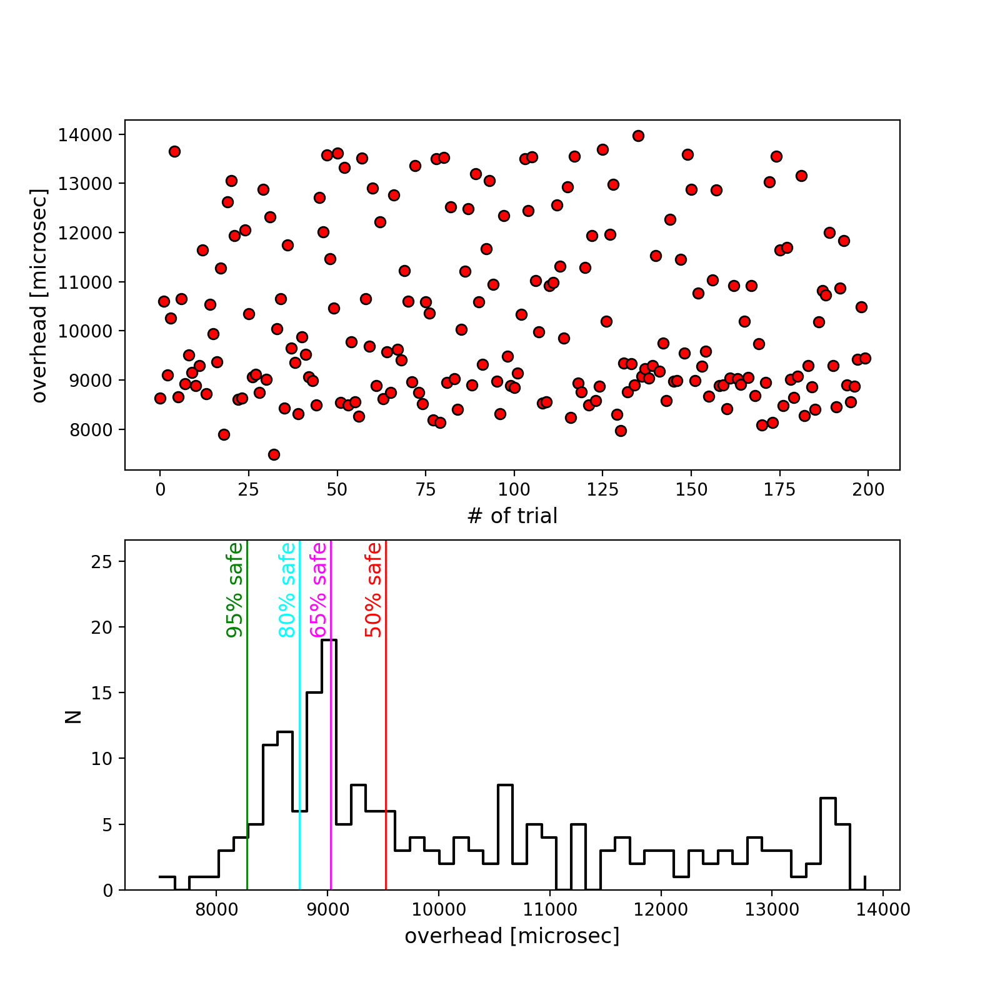

What is _jackpot_?
==================

_jackpot_ can click the "submit" button at arXiv with a reaction time of a few hundred microseconds, while the median reaction time of human being is 254 milliseconds (i.e., 254000 microseconds).

License and Caveats
===================

You may freely distribute this script, and use it at your own risk. I claim no responsibility if you fail to get tenure due to a mis-click by jackpot.

Purpose
=======

Hopefully arXiv would randomize the new posts each day so that jackpot (and other similar tools hidden in the dark) will become obsolete eventually.

Use
====

Prerequisite
------------

A Linux computer is preferred, as Mac seems to have some problem in synchronizing its clock. It doesn't work on Windows.

If you insist on using Mac, you have to download the [_cliclick_](https://www.bluem.net/en/mac/cliclick/) script to the jackpot directory. In Linux, _xdotool_ should come with your system, otherwise please install _xdotool_ using your favorate package management system.

Synchronize your clock
----------------------

First try to synchronize your clock by running:

    sudo ntpdate -s time.nist.gov

Calibrate out the overhead
--------------------------

The script has some overhead before doing the click, and this overhead varies from computer to computer, so you wanna calibrate out this overhead by running:

    python calibrate.py

The calibration may take a while before producing the histogram below that tells you what value you should use for your overhead estimate, so run it well before your submission time.

Wait and Click
--------------

Based on the calibration, you can choose a conservative estimate of the "overhead_microsec" by simply taking the minimum (7493.0 in the example above), or you can be more aggressive by picking some value that's closer to the mode of the distribution (see the four colored vertical lines above). Then you can simply run the script below, place your cursor over the submit button, and wait.

    python jackpot.py '2017-03-31 14:00:00.000000' 7493.0

To make sure everything works, you may want to do a test run before the submission deadline but remember to place your cursor somewhere safe.

Area of Improvements?
------------

However, the above overhead calculation does not take into account the data transfer time between your location and Ithaca, where the arXiv server supposedly is hosted. For my current location (Columbus, OH), the light travel time between my computer and Cornell is on the order of 2500 microseconds --- given that the data transfer speed is always (much) lower than the speed of light (depending on the refractive index of the medium), so there should be some good cusion between a slightly more risky choice of 'overhead_microsec' and the true value.

Go bold or go home! 
